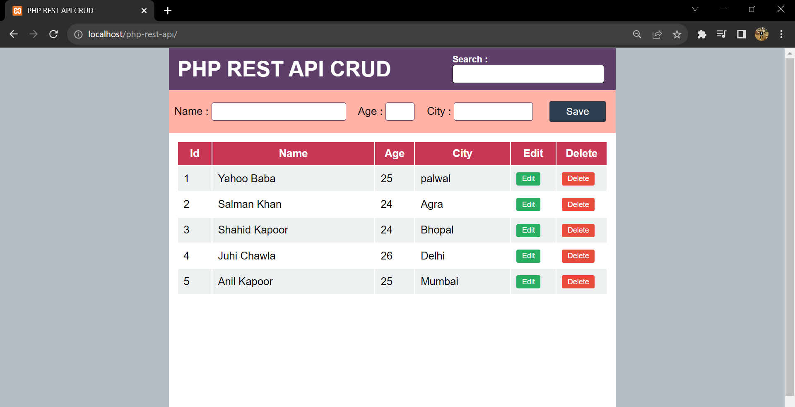

<h1> Php Rest Api CRUD Web App</h1>

- This webapp uses REST API for retrieving and modifying data from database.
- Made with JavaScript, HTML5 and CSS3.

## About this application:

* This website performs CRUD operations such as creation of new data or inforamation.
* This website performs deletion and updation of existing data.

- [x] Landing Page:

- [x] Edit Operation:

  
